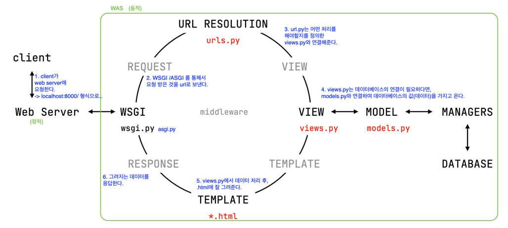
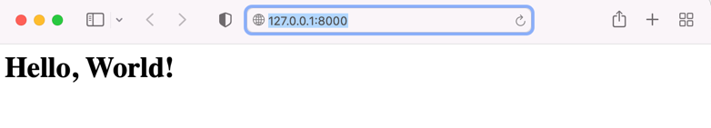

## Django
Django : 파이썬을 통해 웹을 만들기 위한 프레임워크 <br>
https://www.djangoproject.com <br>
Documentation > The model layer , The view layer , The template layer <br>
Forms 부터는 장고를 편하기 사용하기 위한 기능들을 설명 해둔 것

### 프레임워크란? 
> 프로그램을 만들기 위해 공통적인 부분을 미리 만들어 놓고, 완성하기 위해 기능을 추가하면 프로그램이 완성되는 코드 뭉치

### Install
```python 
Django-admin startproject [ProjectName] 
```
project 안에 manage.py 와 projectname을 가진 파일이 생성된다. 


### 개념



> `./`  : root (가장 최상위 위치) <br>
> `./`  : 나 기준, 현재 위치 <br>
> `../` : 나 기준, 상위 위치 

### 문법
#### 1. path 함수를 사용하여 url  <-> function (views.py) mapping
```python
path('mysite/hello', views.hello)
# url에 'mysite/hello'로 요청이 들어온다면, views에 있는 hello 함수가 실행된다.
# 실행되는 함수인 hello는 콜백함수로, 뒤에 괄호가 붙지 않는다.
# 콜백 함수 : ~한 요청이 들어왔을 때, 해당 함수를 실행하는 것
```
#### [ python Hello folder ]
##### urls.py
```python 
from django.contrib import admin
from django.urls import path, include
from . import views

# path 쓸때 뒤에 ',' 꼭 사용!
urlpatterns = [
    path('admin/', admin.site.urls),
    path('',views.index), # 아무것도 입력이 안되면(기본 요청) veiws.index를 실행 할 것이다.
    # '' : 127.0.0.1:8000/ -> 기본 요청, 최상위 요청
    path('hello01/', include('hello01.urls')), # _/hello01/ 요청이 들어오면 hello01.urls로 가라 
]
```
> include : 최상위 urlconf에서 urlpattern들을 적다보면 코드가 관리하기 어려워 질 수 있다. 이때 include 함수를 사용하여 리팩토링을 한다. 

##### views.py
```python 
from django.http import HttpResponse

def index(request):
    return HttpResponse('<h1>Hello, World!</h1>') # 괄호 안 : 문서 형식
    # HttpResponse : http 규격에 맞춰 응답해줘라
```
> 클라이언트가 서버에게 Http에 맞춰서 request 하면 서버는 클라이언트에게 documnet로 response 한다. 

#### [ python Hello01 folder ]
##### urls.py
- hello/urls에서 'hello01/'이 실행된다면 hello01.url로 가라는 path를 설정 해 주었기 때문에 
    해당 파일에서는 'hello01/'을 사용하지 않는다. 

```python
from django.urls import path
from . import views

urlpatterns = [
    # '' : 127.0.0.1:8000/hello01/
    path('',views.index),
    path('test/',views.test),
    path('my/',views.my),
]
```

##### views.py
```python 
from django.shortcuts import render
from django.http import HttpResponse

# Create your views here.

def index(request):
    return HttpResponse("<h1><a href='/hello01/test'>Hello, Django</a></h1>")

def test(request):
    return HttpResponse("<h1><a href='/hello01'>return</a></h1>")

def my(request):
    return HttpResponse("<h1>홍길동</h1>")
```

```
server side rendering (SSR): server에서 그려줄거야 _ Backend
    - 요청이 들어오면 서버에서 미리 만들어서 html로 document를 응답한다. 
client side rendering (CSR): client에서 그려줄거야 _ Fontend
    - 요청이 들어오면 요청에 맞는 데이터가 응답이 되고, 클라이언트 파트에서 데이터를 받아 응답한다. 
```

### Hello project 실행 
`(multi) ~/hello>` python manage.py runserver 




#### [ tags folder ]
##### templates folder > index.html 
```html  
<!DOCTYPE html>
<html lang="en">
<head>
    <meta charset="UTF-8">
    <title>Title</title>
</head>
<body>

    <h1>Hello, {{ name }}</h1>  
    <!-- {{ 변수 }} : 변수의 실제 값을 화면에 표현해 주세요. **동적! SSR** -->

    <a href="var/">variable</a>
    <br>

    <a href="statics/">statics files</a>

</body>
</html>
```
#### tags folder > views.py
```python 
from django.shortcuts import render

def index(request):
    # render : 요청(request)에 맞게 딕셔너리 형식으로 변수의 값을 전달 받은 파일('index.html' = templates)을 그려줘라
    return render(request, 'index.html',{'name' : '홍길동'})
```
#### tags folder > urls.py
```python 
from django.contrib import admin
from django.urls import path, include
from . import views

urlpatterns = [
    path('admin/', admin.site.urls),
    path('', views.index),
    path('var/',include('var.urls')),
    path('statics/',include('statics.urls'))
]
```


